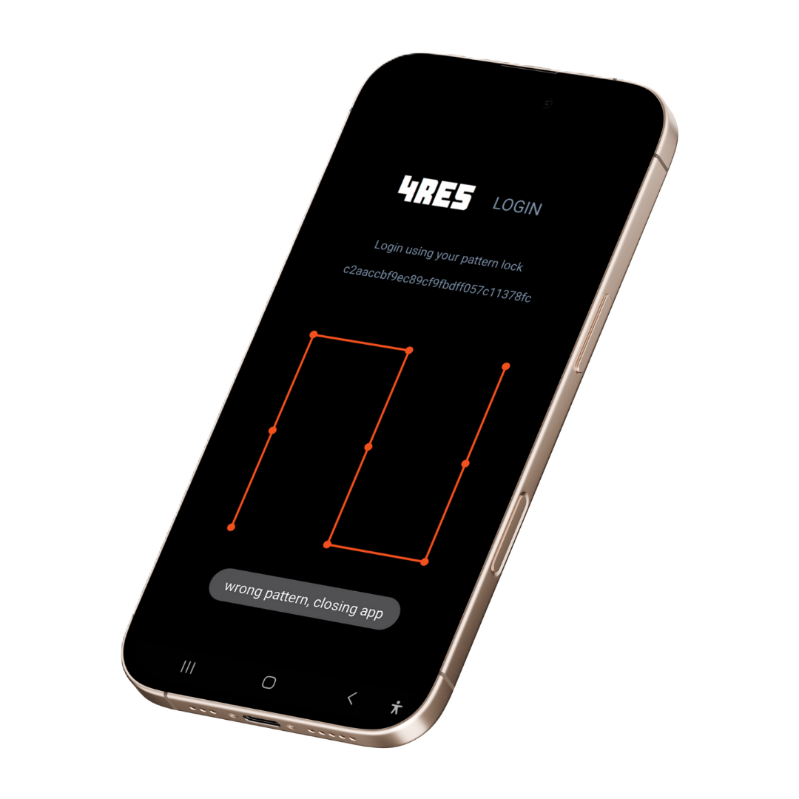
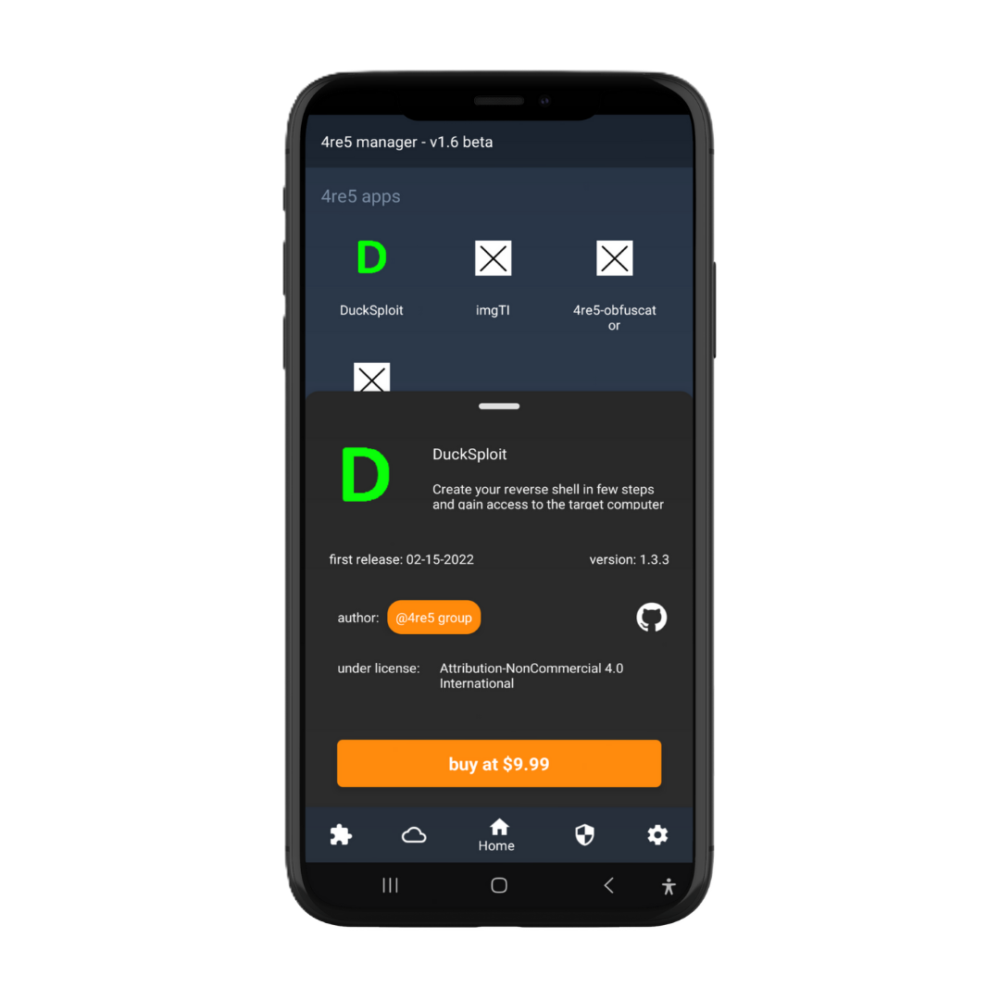

# 4re5-manager

Official 4re5 app downloader &amp; updater with 4re5 security features for authentification and more

## Installation
### Android
1. Download [apk file](https://github.com/4RE5group/4re5-manager/releases/download/v1.7-beta/release.apk)
2. Install apk from an apk installer

## Features

### Security 🔒
---

 

4re5 manager uses a **secure encryption algorithm** to keep your 4re5 accounts in a secure place. 
- Everything is encrypted from login to personnal data
- Enhanced protection against attackers
  

 

### Easy to use 📊
---

 

Keep track of lastest softwares updates with ease with **4re5 manager**
- Everything accessible from a single click
- No ads, no clickbait
- Frequent updates
- Maintained security patches

  

## Todo list
- [ ] Implement Windows version 
- [ ] Implement Linux version

Made with ♥ by 4re5 group