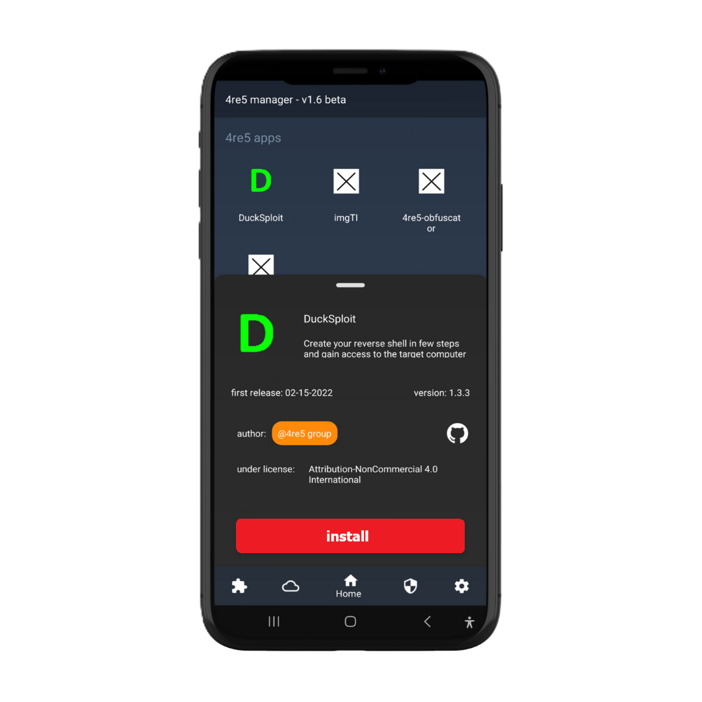

# 4re5-manager


Official 4re5 app downloader &amp; updater with 4re5 security features for authentification and more

## Installation
### Windows
1. Download the [installer](https://github.com/4RE5group/4re5-manager/releases/latest/download/release_windows.apk)
2. Install with admin rights

### Android
1. Download the latest [apk file](https://github.com/4RE5group/4re5-manager/releases/latest/download/release_android.apk)
2. Install apk from an apk installer
 
### Linux (Debian based operating systems)
```
wget https://github.com/4RE5group/4re5-manager/releases/latest/download/release_linux.deb
sudo dpkg -i release.deb
```

## Features

### Security 🔒
---


<br>

4re5 manager uses a **secure encryption algorithm** to keep your 4re5 accounts in a secure place. 
- Everything is encrypted from login to personnal data
- Enhanced protection against attackers
<br><br>
 
<br>

### Easy to use 📊
---



<br>

Keep track of lastest softwares updates with ease with **4re5 manager**
- Everything accessible from a single click
- No ads
- Frequent updates
- Maintained security patches


<br><br>

## Todo list
- [x] Windows version 
    - [ ] Implement authentification system
    - [ ] Handle server, cli and app types

- [x] Android
    - [x] Implement authentification system
    - [ ] Handle server, cli and app types

- [x] Linux version
    - [ ] Implement authentification system
    - [x] Implement cli commands
    - [ ] Handle server, cli and app types


Made with ♥ by 4re5 group

